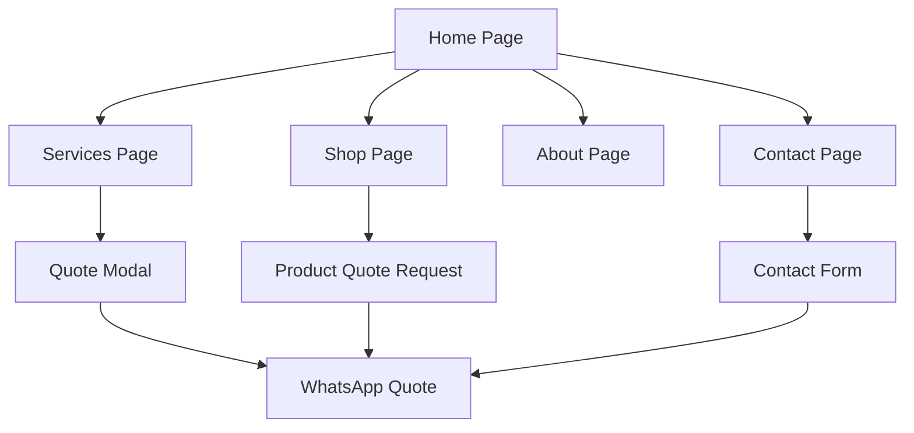

## 1. Product Overview

Madiega Trading Enterprise is a professional multi-trade service website for a Gauteng-based company specializing in Solar & Electrical installations, Plumbing, Construction, and Security solutions. The platform serves as a comprehensive digital presence with an integrated online shop for products.

The website solves the problem of fragmented service discovery by providing a single, professional platform where customers can explore multiple trade services, view available products, and request quotes. Built with a config-driven architecture, it enables complete rebranding for any client by simply swapping the config.js file.

## 2. Core Features

### 2.1 User Roles

| Role | Registration Method | Core Permissions |
|------|---------------------|------------------|
| Website Visitor | No registration required | Browse services, view products, request quotes via WhatsApp |
| Potential Customer | No registration required | Access all content, submit quote requests, contact via multiple channels |

### 2.2 Feature Module

The website consists of the following main pages:
1. **Home page**: Hero section, services overview, product teaser, testimonials, trust indicators, quote banner
2. **Services page**: Detailed service descriptions, features lists, quote request modal
3. **Shop page**: Product catalog with category filtering, quote-based purchasing
4. **About page**: Company information, locations, credentials, company story
5. **Contact page**: Contact form, location details, embedded map, service request functionality

### 2.3 Page Details

| Page Name | Module Name | Feature description |
|-----------|-------------|---------------------|
| Home | Hero Section | Display full-viewport hero with dark overlay, business tagline, CTAs for quote and services |
| Home | Services Strip | Show 4 service cards with icons, names, descriptions, and learn more links |
| Home | Shop Teaser | Display first 4 products with pricing, badges, and quote request buttons |
| Home | Trust Section | Present 4 trust points with icons and brief descriptions |
| Home | Testimonials | Show 3 customer testimonials with ratings, quotes, and service tags |
| Home | Quote Banner | Full-width banner with headline, subtext, and contact CTAs |
| Services | Service Details | Display alternating layout sections for each service with images, features, and CTAs |
| Services | Quote Modal | Modal form for service-specific quote requests that opens WhatsApp with pre-filled message |
| Shop | Product Grid | 3-column responsive grid showing products with images, pricing, and quote buttons |
| Shop | Category Filter | Tab-based filtering for All, Solar, Plumbing, Security categories |
| Shop | Product Cards | Individual cards with stock indicators, badges, and WhatsApp quote integration |
| About | Company Info | Display founding year, coverage area, project statistics, and company story |
| About | Location Cards | Two location cards with addresses and contact information |
| About | Credentials | Trust badges and certification information |
| Contact | Contact Form | Form with name, phone, service dropdown, location, and message fields |
| Contact | Location Details | Business addresses, phone numbers, and embedded Google Maps |
| Contact | Callout Info | Prominent display of R450 callout fee with credit information |

## 3. Core Process

**Visitor Journey Flow:**
1. User lands on homepage and sees hero section with immediate value proposition
2. User can explore services through the services strip or navigate to dedicated services page
3. User browses products in the shop teaser or full shop page with category filtering
4. User reads testimonials and trust indicators to build confidence
5. User requests quotes through multiple CTAs that open WhatsApp with pre-filled messages
6. User can contact directly via phone, WhatsApp, or contact form

**Quote Request Process:**
1. User clicks any "Get Quote" or "Request Quote" button
2. System opens WhatsApp with pre-filled message containing service/product details
3. User can customize message and send directly to business WhatsApp
4. Business receives immediate notification and can respond within 24 hours

## 4. User Interface Design

### 4.1 Design Style
- **Primary Color**: Electric green (#22c55e) for CTAs and highlights
- **Background**: Deep navy/charcoal (#0f172a) with darker accents (#020617)
- **Text Colors**: White (#f8fafc) and light grey (#94a3b8) for optimal readability
- **Typography**: Google Fonts 'Inter' throughout — 400 body, 600 subheadings, 700 headings
- **Button Style**: Rounded corners with solid green for primary actions, outlined for secondary
- **Layout**: Card-based design with dark backgrounds and green accent borders
- **Icons**: Professional, minimal icons that complement the trustworthy aesthetic
- **Animations**: Subtle fade-up on scroll using Framer Motion, no flashy effects

### 4.2 Page Design Overview

| Page Name | Module Name | UI Elements |
|-----------|-------------|-------------|
| Home | Hero Section | Full-viewport dark overlay on solar image, green accent badge, large headline in white, two CTAs with contrasting styles |
| Home | Services Strip | Dark cards with green left border, service icons in green, clean typography with proper spacing |
| Home | Shop Teaser | Product cards with real images, green badges, clear pricing, consistent card heights |
| Services | Service Details | Alternating image/text layout, green checkmark icons for features, prominent callout fee badges |
| Shop | Product Grid | Responsive 3-2-1 column layout, consistent card styling, green stock indicators |
| Contact | Contact Form | Clean form fields with proper validation states, green submit button, adjacent map embed |

### 4.3 Responsiveness
- **Mobile-First Approach**: Designed primarily for mobile devices with progressive enhancement for larger screens
- **Breakpoints**: Tailwind's default breakpoints (sm: 640px, md: 768px, lg: 1024px, xl: 1280px)
- **Touch Optimization**: Large tap targets for mobile navigation, appropriate spacing for touch interactions
- **Performance**: Optimized image loading with responsive Unsplash URLs, minimal JavaScript for fast mobile performance

### 4.4 Component Architecture
- **Sticky Navbar**: Dark background with subtle border, business name in green, mobile hamburger menu
- **Footer**: 4-column layout on desktop, stacked on mobile, trust badges row, copyright information
- **WhatsApp Button**: Fixed bottom-right position, green circular design with WhatsApp icon
- **Quote Modal**: Centered modal with form fields, smooth animations, WhatsApp integration