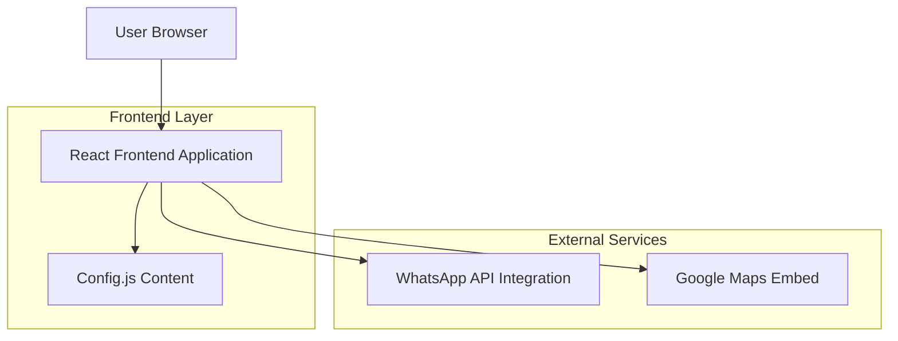

## 1. Architecture Design

## 2. Technology Description

- **Frontend**: React@18 + tailwindcss@3 + vite
- **Initialization Tool**: vite-init
- **Animation**: Framer Motion for subtle scroll animations
- **Icons**: Lucide React for consistent iconography
- **Backend**: None (static site with WhatsApp integration)
- **Content Management**: Centralized config.js file for complete rebranding capability

## 3. Route Definitions

| Route | Purpose |
|-------|---------|
| / | Home page with hero, services overview, testimonials, and quote banner |
| /services | Detailed service descriptions with quote request functionality |
| /shop | Product catalog with category filtering and quote-based purchasing |
| /about | Company information, locations, credentials, and company story |
| /contact | Contact form with map embed and location details |

## 4. Component Architecture

### 4.1 Core Components
- **App.jsx**: Main router component managing page navigation
- **Navbar.jsx**: Sticky navigation with mobile hamburger menu
- **Footer.jsx**: 4-column footer with trust badges and links
- **WhatsAppButton.jsx**: Fixed position WhatsApp contact button
- **QuoteModal.jsx**: Reusable modal for service/product quote requests

### 4.2 Page Components
- **Home.jsx**: Landing page with hero, services, products, testimonials
- **Services.jsx**: Service detail pages with alternating layouts
- **Shop.jsx**: Product grid with category filtering
- **About.jsx**: Company information and credentials
- **Contact.jsx**: Contact form with map integration

## 5. Content Management System

### 5.1 Config.js Structure
The centralized configuration file contains:
- Business information (name, contact details, locations)
- Brand colors and styling constants
- Service definitions with features and pricing
- Product catalog with categories and pricing
- Testimonials and trust indicators
- Social media links and WhatsApp integration

### 5.2 Rebranding Capability
Complete site rebranding achieved by:
1. Replacing entire config.js file
2. Updating business-specific content
3. Modifying brand colors and imagery
4. Maintaining consistent structure and functionality

## 6. WhatsApp Integration

### 6.1 Quote Request Flow
- All quote buttons trigger WhatsApp with pre-filled messages
- Messages include service/product name and pricing
- Direct integration with business WhatsApp number
- No backend required for quote processing

### 6.2 Contact Form Integration
- Form submissions open WhatsApp with user details
- Pre-formatted message includes all form fields
- Immediate notification to business WhatsApp

## 7. Performance Optimization

### 7.1 Image Optimization
- Unsplash URLs with width parameters for responsive loading
- Lazy loading for below-fold images
- Optimized image formats (WebP where supported)

### 7.2 Bundle Optimization
- Vite-based build system for optimal bundling
- Code splitting for route-based loading
- Minimal dependencies to reduce bundle size

## 8. Mobile Responsiveness

### 8.1 Breakpoint Strategy
- Mobile-first CSS approach using Tailwind utilities
- Responsive grid layouts (1-2-3 columns based on screen size)
- Touch-optimized interactive elements
- Appropriate font sizing for mobile readability

### 8.2 Navigation Adaptation
- Hamburger menu for mobile devices
- Full-screen overlay navigation on mobile
- Sticky header with phone number always visible

## 9. Accessibility Considerations

### 9.1 Semantic HTML
- Proper heading hierarchy throughout pages
- ARIA labels for interactive elements
- Alt text for all images
- Keyboard navigation support

### 9.2 Color Contrast
- High contrast ratios for text readability
- Green accent color tested for accessibility
- Sufficient color differentiation for interactive elements

## 10. Deployment Strategy

### 10.1 Static Site Generation
- React SPA built with Vite
- Static assets optimized for fast loading
- CDN-friendly architecture
- Environment-specific builds for different clients

### 10.2 Content Updates
- Config.js updates require rebuild and redeploy
- No dynamic content management system needed
- Simple file replacement for complete rebranding